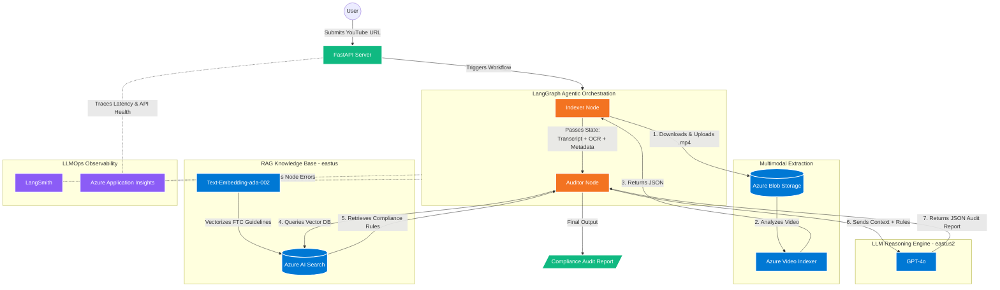

# Agentic Multimodal Compliance Engine

An industry-grade LLMOps project featuring a stateful Agentic RAG workflow built with LangGraph, Azure OpenAI, and Azure AI Search. This system automates the compliance auditing of multimodal video advertisements by comparing them against regulatory guidelines (FTC & YouTube Ad Specs).

## Key Features

Agentic Orchestration: Uses LangGraph to manage a multi-node workflow (Indexer -> Auditor).

Multimodal Extraction: Leverages Azure Video Indexer to bridge video content (OCR + Transcripts) to LLM-readable data.

Hybrid RAG: High-precision retrieval of regulatory clauses using Azure AI Search.

LLMOps Observability: Full execution tracing and prompt debugging via LangSmith and Azure Application Insights.

Production API: Backend built with FastAPI featuring strict schema validation.

## Architecture

Entry Point: User submits a YouTube URL via FastAPI.

Video Indexing Node: Azure Video Indexer processes the video to extract transcript and onscreen text (OCR).

Knowledge Base: Regulatory PDFs are chunked and indexed in Azure AI Search.

Auditor Node: GPT-4o performs reasoning by comparing the extracted evidence against retrieved rules.

Output: A structured JSON compliance report (Pass/Fail) with severity ratings.

## Setup

Clone the repository.

Install dependencies using uv:

uv sync

Copy .env.example to .env and fill in your Azure & LangSmith credentials.

Run the indexing script to populate your Knowledge Base:

python backend/scripts/index_documents.py

Start the API server:

uv run uvicorn backend.src.api.server:app --reload
